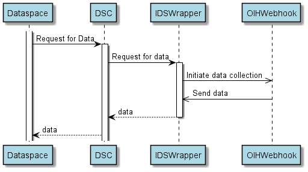

## IDS-Wrapper
The IDS-Wrapper provides the capabilities for a central data integration
from the OIH to [International Data Spaces](https://internationaldataspaces.org/). Currently, there are three components
interacting with each other to allow the data exchange between the Open
Integration Hub and a Data Space. These components are the **OIH**, the **[Dataspace Connector (DSC)](https://www.dataspace-connector.io)** and the **IDS-Wrapper**.
The OIH contains the data which is to be made
available in the dataspace. The DSC is the gateway to the dataspace and contains all the
necessary functionally to communicate within other participants of the dataspace.
Whereas the OIH uses asynchronous webhooks, the dataspace synchronous messages
are required to exchange data. Therefore, the IDS-Wrapper was implemented 
to bridge the gap between these different messages. The overview of connectivity of OIH-IDS can be found [here](https://openintegrationhub.github.io/docs/4/ForDevelopers/IDS-Connectivity.html). **[TODO]** Later in the *Usage* section there will be step-wise example to setup everything and running a flow to show connectivity. 




## Installation

Clone this repository and navigate to the root folder and run the following commands

### Run locally
```bash
./mvnw clean package
cd target
java -jar ids-wrapper-{version}.jar
```
### Run with docker
```bash
mvn clean package
docker build --tag=this:latest .
docker run -p8887:8080 this:latest
```

## Usage
### Requirements
- OIH(Open Integration Hub) Please make sure to clone the [monorepo](https://github.com/openintegrationhub/openintegrationhub) and follow the instruction to install it on the system before you start.
- [Dataspace Connector (DSC)](https://www.dataspace-connector.io)
- [IDS-SQL-Adapter](https://github.com/openintegrationhub/IDS-SQL-Adapter) (component)
- [IDS-Gateway](https://github.com/openintegrationhub/IDS-gateway#actions) (component)

To initiate the data collection a resource needs to be registered at the DSC as described [here](https://github.com/openintegrationhub/IDS-gateway#actions). 
In the respective resource the URL to the `/service` endpoint of the IDS-Wrapper has to be entered.
This endpoint takes two parameters. The flowId of the flow to be triggered and filter which are the
uids of the dataset to be queried.
`GET` `/service?flowId={flowID}&filter={uid}`
Once this request is sent to the IDS-Wrapper it calls the flow and waits for an incoming
`POST` request at the `/webhook` endpoint. **The request body received from the webhook will 
be passed through the pending initial request of the DSC**. 
For testing purposes there is another endpoint `/test`
that calls the `/webhook` endpoint

##### Example
`http://localhost:8081/service?flowId=http://localhost:8081/test&filter=32eb946a4e3c72b8a42dd16b387e74ee`

Sends the following request: 
`POST` `http://localhost:8081/test`
``` json
{
  "data": {
    "filter": [32eb946a4e3c72b8a42dd16b387e74ee
    ]
  },
  "metadata": {}
}
```

