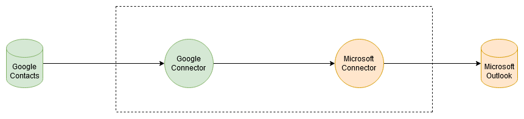

#### Table of contents
- [IDS-Wrapper](#ids-wrapper)
- [Usage](#usage)
  * [Requirements](#requirements)
  * [Installation Steps](#installation-steps)
  * [Running flows](#running-flows)
    + [Definition](#definition)
    + [IDS - OIH Connectivity flow](#ids---oih-connectivity-flow)
    + [Example](#example)
  * [Valid Resource](#valid-resource)
    + [Registering Valid Resource](#registering-valid-resource)
      - [Requirements:](#requirements-)
      + [Steps for Installation of DSC-UI:](#steps-for-installation-of-dsc-ui-)
      - [Steps for Registering Example Resource using DSC-UI and DSC:](#steps-for-registering-example-resource-using-dsc-ui-and-dsc-)
      - [Steps for Sending Resource to Meta-Data Broker using DSC:](#steps-for-sending-resource-to-meta-data-broker-using-dsc-)
  * [Understanding IDS-Wrapper API](#understanding-ids-wrapper-api)
      - [Example](#example-1)
  * [Troubleshooting](#troubleshooting)


# IDS-Wrapper
The IDS-Wrapper provides the capabilities for a central data integration
from the OIH to [International Data Spaces](https://internationaldataspaces.org/). Currently, there are three components
interacting with each other to allow the data exchange between the Open
Integration Hub and a Data Space. These components are the **OIH**, the **[Dataspace Connector (DSC)](https://www.dataspace-connector.io)** and the **IDS-Wrapper**.
The OIH contains the data which is to be made
available in the dataspace. The DSC is the gateway to the dataspace and contains all the
necessary functionally to communicate within other participants of the dataspace.
Whereas the OIH uses asynchronous webhooks, the dataspace synchronous messages
are required to exchange data. Therefore, the IDS-Wrapper was implemented 
to bridge the gap between these different messages. The overview of connectivity of OIH-IDS can be found [here](https://openintegrationhub.github.io/docs/4/ForDevelopers/IDS-Connectivity.html).

<p align="center">

</p>

# Usage
Before using the IDS-wrapper please make sure following requirements are fullfiled:
## Requirements
- OIH(Open Integration Hub) Please make sure to clone the [monorepo](https://github.com/openintegrationhub/openintegrationhub) and follow the instruction to install it on the system before you start. 
- [IDS-SQL-Adapter](https://github.com/openintegrationhub/IDS-SQL-Adapter) (OIH component)
- [IDS-Gateway](https://github.com/openintegrationhub/IDS-gateway#actions) (OIH component)
- [Dataspace Connector (DSC)](https://www.dataspace-connector.io)
- [IDS Metadata Broker](https://github.com/International-Data-Spaces-Association/metadata-broker-open-core)
- [Dataspace Connector UI (DSC-UI)](https://github.com/International-Data-Spaces-Association/DataspaceConnectorUI)
- A running SQL(e.g. PostgreSQL) database where the data can be stored.

## Installation Steps

- Install OIH using one of the methods listed [here](https://openintegrationhub.github.io/docs/4%20-%20ForDevelopers/Intro.html). It is recommended to use a Linux system with Docker installation.
    - Login into the OIH using `web-ui.example.com`(adjust the `web-ui` url if you have changed default) and ``` "username": admin@openintegrationhub.com ,
  "password": somestring``` 
<p align="center">

</p>

  - Go to `Components` on left panel and click on `Add` to add new components.
<p align="center">

</p>

  - Please put the docker image URL for the respective components in `image:` atrribute:
  
```yaml
    {
  distribution: {
    type: 'docker',
    image: 'COMPONENT'S IMAGE URL HERE'
  },
  name: 'ids-sqladaptar',
  description: 'string',
  access: 'public',
  isGlobal: true,
  active: false,
  descriptor: {
    actions: [],
    triggers: []
  ```

   - Now, Add the components [IDS-SQL-Adapter](https://github.com/openintegrationhub/IDS-SQL-Adapter) and [IDS-Gateway](https://github.com/openintegrationhub/IDS-gateway#actions) to OIH like in the following image and make sure to start them:

- Install and run [Dataspace Connector (DSC)](https://www.dataspace-connector.io) and [IDS Metadata Broker](https://github.com/International-Data-Spaces-Association/metadata-broker-open-core). Alternatively, if they are already running versions, they can be used as well.
- Install and run **IDS-Wrapper** as described:

  - Run locally

    ```bash
    ./mvnw clean package
    cd target
    java -jar ids-wrapper-{version}.jar
    ```
  - Run with docker

    ```bash
    mvn clean package
    docker build --tag=this:latest .
    docker run -p 8887:8080 this:latest
    ```

## Running flows

### Definition 

- A **Component** is a small set of functions packaged as a Docker image. The OIH runs these images as containerized 
applications, passing data into them and executing the functions provided by the component.
- A **Flow** connects components to one another. it allows you to automatically pass data through a series of user-defined 
components, allowing you to transfer and modify it according to your requirements.


The figure below demonstrates a flow that downloads contacts from Google Contacts to Outlook. For that, we'll need two components: one to retrieve the contacts from Google Contacts and another to insert the contacts into Outlook.



### IDS - OIH Connectivity flow 

There are two flows to run in order to test the communication between IDS and OIH. The first one is known as data registration, while the second one is known as data request.

The two flows can be described as in the following image from [OIH Documentation](https://openintegrationhub.github.io/docs/4%20-%20ForDevelopers/IDS-Connectivity.html):
<p align="center">

</p>

**Register data:**
1. Flow 1 is triggered by a webhook or cron job event and receives or polls data from a data source.
2. Each row of data is described with a UID and saved in an SQL database.
3. The data row is registered with the DSC (Dataspace connector/provider) via POST request.
4. The data row is registered with the IDS broker via POST reuqest to DSC.
5. DSC registers the data.
6. The data can be discovered by an IDS consumer.

**Request data:**

7. An IDS consumer requests data by using the UID.
8. DSC requests the data by sending a GET request containing the flow ID to the IDS-Wrapper.
9. IDS-Wrapper triggers flow 2 by a POST request containing the data UID.
10. Flow 2 fetches the data from the database.
11. The fetched data is sent back to the IDS-Wrapper via POST request.
12. IDS-Wrapper sends the data back to the DSC as a GET response.
13. DSC responds to the IDS broker by sending the data artifact.
14. IDS broker sends requested data back to the IDS consumer.

### Example

1. Registering data flow:
```yaml
{
  status: 'inactive',
  name: 'SQL to SQL to DSC (Flow 1)',
  description: 'This is an example flow to use the OIH-IDS Gateway in combination with the IDS-SQL adapter',
  graph: {
    nodes: [
      {
        id: 'step_1',
        componentId: '',
        name: 'Connector X',
        function: 'getData',
        description: 'Data source component',
        fields: {
        }
      },
      {
        id: 'step_2',
        componentId: '',
        name: 'IDS-SQL Adapter',
        function: 'addData',
        description: 'Extracts predefined columns from incoming data row and stores it in database with an individually generated UID',
        fields: {
          databaseType: '',
          user: '',
          password: '',
          databaseUrl: '',
          port: '',
          databaseName: '',
          query: 'INSERT INTO oih_ids_iot_test_data_sink(uidIDS,Column2,Column3) VALUES (\'{uidIDS}\',\'{VALUE1}\',\'{VALUE2}\')'
        }
      },
      {
        id: 'step_3',
        componentId: '',
        name: 'OIH-IDS Gateway',
        function: 'registerRessource',
        description: 'Registers incoming data with the DataSpaceConnector and IDS Broker',
        fields: {
          urlDataSpaceConnector: 'https://DataSpaceConnector-ADDRESS/admin/api/resources/resource',
          urlBroker: 'https://DataSpaceConnector-ADDRESS/admin/api/broker/register?broker=https://IDS-Broker-ADDRESS/infrastructure',
          user: '',
          password: '',
          body: {
            title: 'MachineX-Data',
            description: 'Aggregated sensor data',
            representations: [
              {
                type: 'JSON',
                name: 'MaschineX',
                source: {
                  type: 'http-get',
                  url: 'https://IDS-Wrapper-ADDRESS?endpoint=OIH-ADDRESS/hook/FLOW2-ID&uid={uidIDS}'
                }
              }
            ]
          }
        }
      }
    ],
    edges: [
      {
        source: 'step_1',
        target: 'step_2'
      },
      {
        source: 'step_2',
        target: 'step_3'
      }
    ]
  },
  owners: [
    {
      id: '',
      type: 'user'
    },
    {
      id: '',
      type: 'user'
    }
  ],
  createdAt: '',
  updatedAt: '',
  id: ''
}
```

2. Requesting data flow:

```yaml
{
  status: 'inactive',
  name: 'OIH-IDS Gateway (Flow 2)',
  description: 'This is a webhook-based flow and expects a filter with uids of the resources',
  graph: {
    nodes: [
      {
        id: 'step_1',
        componentId: '',
        name: 'OIH-IDS Gateway',
        function: 'getRessourceQuery',
        description: 'Creates a SQL query from incoming data',
        fields: {
          query: 'SELECT * FROM public.oih_ids_iot_test_data_sink WHERE uidids in ({filter})'
        }
      },
      {
        id: 'step_2',
        componentId: '',
        name: 'IDS-SQL Adapter',
        function: 'getDataPolling',
        description: 'Exemplary flow node',
        fields: {
          databaseType: 'postgresql',
          user: '',
          password: '',
          databaseUrl: '',
          port: '',
          databaseName: ''
        }
      },
      {
        id: 'step_3',
        componentId: '',
        name: 'OIH-IDS Adapter',
        function: 'postIDS',
        description: 'Sends incoming data to IDS-Wrapper',
        fields: {
          uri: 'http://IDS-Wrapper-ADDRESS/webhook'
        }
      }
    ],
    edges: [
      {
        source: 'step_1',
        target: 'step_2'
      },
      {
        source: 'step_2',
        target: 'step_3'
      }
    ]
  },
  owners: [
    {
      id: '',
      type: 'user'
    }
  ],
  createdAt: '',
  updatedAt: '',
  id: ''
}
```

## Valid Resource 
In order for the resource registeration to be successful, However, a resource must meet some requirements:
- Resource have to be defined and linked to a catalog, representation, and contract
- Representation have to be linked to an artifact
- Contract have to be linked to a rule

The image below illustrates what a valid resource looks like:

<p align="center">

</p>

### Registering Valid Resource 

To register a valid resource to DSC we require DSC-UI. The DSC-UI will provide all necessary fields needed to register a valid resource.

#### Requirements:

Make sure following applications are up and running:

- [Dataspace Connector (DSC)](https://www.dataspace-connector.io)
- [IDS Metadata Broker](https://github.com/International-Data-Spaces-Association/metadata-broker-open-core)

Following are the steps to setup and register an example resource data using DSC-UI:

###### Steps for Installation of DSC-UI:
1. clone the repository [Dataspace Connector UI (DSC-UI)](https://github.com/International-Data-Spaces-Association/DataspaceConnectorUI)
2. Then build and start the DSC-UI using docker by following this [link](https://github.com/International-Data-Spaces-Association/DataspaceConnectorUI#start-with-docker) or it can be run using `npm` by following this [link](https://github.com/International-Data-Spaces-Association/DataspaceConnectorUI#installation)
3. Now you can open the application in the browser using following urls based on the installation method:
  - docker:`localhost:8083` 
  - npm:`localhost:8082`
<p align="center">

</p>


#### Steps for Registering Example Resource using DSC-UI and DSC:
We will see an example on how to register a resource using DSC-UI and DSC. 

- *Note*:
  - We have modified the default ports for DSC, i.e, DSC is running on port `6060` instead of `8080`.
  - We are using a pre-build meta broker from following url `https://demo3.iais.fraunhofer.de/browse/` which is used for testing and development purpose at `Fraunhofer`. In order to access the url you need to connect to the Fraunhofer VPN.
  
1. Click on the options on left panel to start the adding offering process`data offering` -> `offerings` -> `Add offering`
<p align="center">

</p>

2. Fill out the `Meta Data` section with some example data as shown in image below and click on `Next` located at bottom.
<p align="center">

</p>

3. In `Policy` section we need to create a `contract` using DSC. 
   In order to create contract we will use DSC API via swagger UI. The steps are given below: 
    - visit swagger UI `localhost:6060/api/docs` . If it prompts for authentication then please enter `*Username*: admin` and `*password*: password` .
    - Go to `Contract` for viewing different endpoints to perform operation on contracts.
    - Perform a `Post` request at `/api/contracts` endpoint to create `sample contract` which can be later used in DSC-UI.

   Now, we can see a `sample contract` which we just created using DSC APIs in `Select a Policy Pattern template`. Other fields can be fields can be filled as shown in image below and then click on `Next`.
<p align="center">

</p>
4. Choose any file in the `Representation` section and click `Next`

5. Similar to Step 3, inside `Catalog` section we need to create a `catalog` using DSC. 
   In order to create catalog we will use DSC API via swagger UI. The steps are given below: 
    - visit swagger UI `localhost:6060/api/docs` . If it prompts for authentication then please enter `*Username*: admin` and `*password*: password` .
    - Go to `Catalogs` for viewing different endpoints to perform operation on catalog.
    - Perform a `Post` request at `/api/catalogs` endpoint to create `sample catalog` which can be later used in DSC-UI.

   Now, we can see a `sample catalog` which we just created using DSC APIs by clicking on `Add Catalog`. Select the `sample catalog` and click on `Next`

 6. Next, in `broker` section skip selecting the broker and click on `Save`
 
 7. Now if we visit `Offering` again we will find the new resource which we just created, will appear in the list.

#### Steps for Sending Resource to Meta-Data Broker using DSC:

1. First, we need to register the DSC in the broker. we will use DSC API via swagger UI. The steps are given below: 
   - visit swagger UI `localhost:6060/api/docs` . If it prompts for authentication then please enter `*Username*: admin` and `*password*: password` .
   - Go to `_Messaging` for viewing different endpoints to invoke sending messages.
   - Perform a `Post` request at `/api/ids/connector/update` endpoint to send an IDS connector or DSC Update Message.
   - click on `Try it out` and paste the url of broker and add `infrastructure` at the end of url, i.e.  `https://demo3.iais.fraunhofer.de/infrastructure`. Then click on `execute`.
   - Now, if you visit the broker at url `https://demo3.iais.fraunhofer.de/browse/` then we will find the broker `Dataspace Connector` appear under `Connector` section.
<p align="center">

</p>

2. In order to send resource to meta-data broker we will use DSC API via swagger UI. The steps are given below: 
   - visit swagger UI `localhost:6060/api/docs` . If it prompts for authentication then please enter `*Username*: admin` and `*password*: password` .
   - Go to `_Messaging` for viewing different endpoints to invoke sending messages.
   - Perform a `Post` request at `/api/ids/resource/update` endpoint to register the resource in broker. click on `Try it out` and then in `recipient` field enter the broker url, i.e. `https://demo3.iais.fraunhofer.de/infrastructure` and in `resourceId` field we need the resource Id of the resource `example resource` which we created using DSC-UI. In order to find the `resourceId` we need to go to `/api/offers` endpoint and click on `Try me out` and then `execute`. Then in `Response body` we will find resource Id under "links" -> "self" -> "href" . It will look like as shown in image below: 
<p align="center">

</p>
3. Now, resource `example resource` will appear in the broker under `Resources` as shown in image.
<p align="center">

</p>

## Understanding IDS-Wrapper API

To initiate the data collection a resource needs to be registered at the DSC as described [here](https://github.com/openintegrationhub/IDS-gateway#actions). 
In the respective resource the URL to the `/service` endpoint of the IDS-Wrapper has to be entered.
This endpoint takes two parameters. The flowId of the flow to be triggered and filter which are the
uids of the dataset to be queried.
`GET` `/service?flowId={flowID}&filter={uid}`
Once this request is sent to the IDS-Wrapper it calls the flow and waits for an incoming
`POST` request at the `/webhook` endpoint. **The request body received from the webhook will 
be passed through the pending initial request of the DSC**. 
For testing purposes there is another endpoint `/test`
that calls the `/webhook` endpoint

#### Example
`http://localhost:8081/service?flowId=http://localhost:8081/test&filter=32eb946a4e3c72b8a42dd16b387e74ee`

Sends the following request: 
`POST` `http://localhost:8081/test`
``` json
{
  "data": {
    "filter": [32eb946a4e3c72b8a42dd16b387e74ee
    ]
  },
  "metadata": {}
}
```
## Troubleshooting

Here are some common errors that could occur and how to fix them:

| Errors        | Possible Fix           |
| ------------- |-------------|
| Component is not accessible      | Check that the component is set to `global`.    |
| Flow is not starting      | Make sure you reload the page after clicking the `start` button. |
| Can't access the Postgres database, DSC or Broker from OIH | If Postgres database, DSC or Broker are hosted in the local host, then OIH Kubernetes cluster will not be able to access them, They must be running in the same Kubernetes cluster or on a dedicated server. This will ensure that all applications are running in same network and able to communicate with each other.    |
| The flow begins late or after a period of time.      | The flow is triggered by a cron job that is executed every time. Make sure the `cron` parameter is set to a shorter period. (Please keep in mind that `cron` does not support seconds.) |
| I get `Resource not found` when sending a resource to the Broker.      | Check if your resource meets the requirements mentioned above. |
| When I create a flow, it does not shown in the flow list.  | Check that all of your flow parameters are in 'yml' format and they are valid. |
| If there is an issue, where can I see the logs?  | Unfortunately, the browser won't tell information about the errors. Check the `Component Orchestrator Logs` or type `minikube dashboard` in terminal, it will launch a webpage and then select `pods`, you will see the flows logs.|
